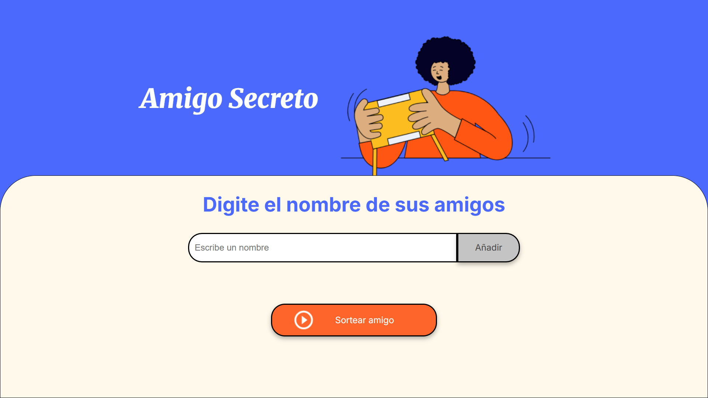

<h1 align="center">🎲 Juego del amigo invisible</h1>

<div align="center">
  


**Una aplicación web simple para agregar el nombre de tus amigos y realizar sorteos aleatorios**

</div>

---

## Características:

- 👥 **Gestión de Amigos**: Agregar nombres fácilmente a tu lista
- 🎯 **Sorteo Aleatorio**: Selección imparcial de un amigo al azar
- 🧹 **Validación Inteligente**: Previene nombres vacíos y duplicados

## 🖥️ Vista Previa

<div align="center">
  


*Interfaz principal de la aplicación*

</div>

## 🎮 Cómo Usar

1. **Agregar Amigos**
   - Escribe un nombre en el campo de texto
   - Presiona "Agregar"
   - El nombre aparecerá en la lista

2. **Sortear**
   - Haz clic en "Sortear Amigo"
   - ¡Ve quién fue el afortunado seleccionado!

3. **Gestionar Lista**
   - Los nombres se mantienen hasta que recargues la página


## 💻 Tecnologías Utilizadas

- **HTML5**: Estructura semántica
- **CSS3**: Estilos modernos y responsive design
- **JavaScript ES6**: Lógica de aplicación
- **DOM API**: Manipulación dinámica del contenido

## 🧠 Funciones Principales

### `agregarAmigo()`
Valida y agrega nombres a la lista de amigos
```javascript
function agregarAmigo() {
  let capturaTexto = document.getElementById("amigo").value;
  if (capturaTexto != "") {
    amigos.push(capturaTexto);
    limpiarCasilla();
    actualizarLista();
  }
}
```

### `sortearAmigo()`
Realiza la selección aleatoria de un amigo
```javascript
function sortearAmigo() {
  if (amigos.length != 0) {
    let indiceAleatorio = Math.floor(Math.random() * amigos.length);
    let nombreSorteado = amigos[indiceAleatorio];
    // ... mostrar resultado
  }
}
```


## 👤 Autor

**Alexis Vespa**
- GitHub: https://github.com/Alexis1005
- LinkedIn: www.linkedin.com/in/vespaalexis
- Email: vespaalexis@gmail.com
